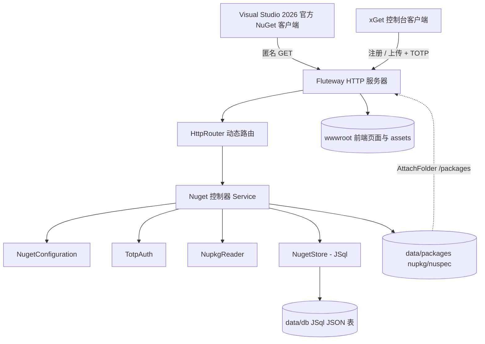

## 产品概述

在现有 xDoc 仓库中开发一个实验性质的 NuGet 包服务器系统：服务端为 Nuget.vbproj（类库，按 NuGet v3 协议提供包服务），客户端为 xGet.vbproj（控制台，负责注册用户与上传包），服务端由外部 Fluteway HTTP 服务器通过反射加载运行，并配套一套与 scibasic.net 风格一致的 Web 管理/展示页面。

## 核心功能

- Fluteway 通过命令行参数接收 Nuget.dll 路径，反射加载其中的 HTTP 控制器并实例化，交给 HttpRouter 路由运行，支持命令行 `Fluteway /run --app ./Nuget.dll --listen=80 --wwwroot=...`。
- 服务端实现 NuGet v3 协议：Service Index、FlatContainer（版本列表与 .nupkg/.nuspec 下载）、Registration 元数据、Search/Autocomplete，供 Visual Studio 2026 官方 NuGet 客户端匿名下载。
- 下载匿名开放；上传必须经 xGet 客户端并通过 TOTP 认证：注册仅提供 email，服务端生成每用户独立的 128 字符随机盐，由 email 加盐派生 TOTP 密钥并以 Base32 返回；客户端本地保存密钥。
- 上传时由客户端用本地密钥生成 TOTP 验证码，连同 email 与 nupkg 一起提交；服务端用 TotpModule 校验，通过才允许上传。
- 提供自定义上传端点（multipart：文件+email+验证码）与兼容标准 push 端点（PUT /api/v2/package，X-NuGet-ApiKey 携带 email:验证码）。
- 使用 JSql 作为数据库引擎存储用户与包元数据；使用 Flute 的 FileSystem.AttachFolder 将数据目录映射为虚拟静态资源目录。
- 数据路径可通过命令行参数或配置文件指定（默认 dist/data），不放在程序目录（服务端运行于 Linux Docker）。
- 提供页面展示包列表、数据库统计信息、包详细信息与下载链接，页面与 JavaScript 置于 dist/wwwroot，样式与 scibasic.net 官网保持一致。

## 技术栈

- 语言/框架：VB.NET，net10.0，SDK 风格项目。
- HTTP：Flute（Flute.Http、HttpRouter、HttpSocket）+ Fluteway CLI 宿主。
- 数据库：JSql（JSql.Engine.SqlEngine，MySQL 子集 SQL，无参数化/事务/自增/BLOB）。
- 压缩/解析：System.IO.Compression.ZipFile 读取 nupkg，System.Xml.Linq 解析 nuspec。
- 客户端：xGet 控制台，System.Net.Http.HttpClient，复用 Nuget.TotpModule。
- 前端：纯 HTML + 自定义 CSS + 原生 JavaScript（无框架，对齐 scibasic.net 内联样式风格）。

## 实现方案

### 总体策略

分四层推进：先增强 Flute（路由与请求体能力），再实现 Fluteway 的 /run 反射加载，然后在 Nuget 服务端实现配置/存储/认证/协议控制器，最后实现 xGet 客户端与 wwwroot 前端。所有新增能力均复用现有模式（IAppHandler、HttpGet/HttpPost 反射注册、App.LogException、JSql.Execute）。

### 关键决策

1. 路由动态化（已确认可改 HttpRouter.vb）：将路由表改为“按 HTTP 方法 + 路径模板”组织；路径按 `/` 分段，`{name}` 段捕获参数，精确匹配优先、模板匹配兜底，保持既有 API 向后兼容。新增 HttpPut/HttpDelete 特性以区分同路径不同方法（自定义上传 POST 与标准 push PUT 均位于 /api/v2/package）。
2. 参数传递：在 HttpRequest 上新增 `RouteData`（Dictionary(Of String, String)），由路由在 Invoke 前填充，handler 通过 `req.RouteData("id")` 读取，不改动既有委托签名 `Sub(HttpRequest, HttpResponse)`。
3. 控制器装载契约：在 Flute 定义 `IHttpAppModule.Mount(router As HttpRouter, config As IReadOnlyDictionary(Of String, String))`；Fluteway 扫描 Nuget.dll 中实现该接口（或含 HttpGet/HttpPost 方法）的 public 类型，Activator 实例化后注册，并通过 config 字典传递 wwwroot/data/listen/app，避免 Fluteway 反向依赖 Nuget（当前依赖方向为 Nuget→Fluteway）。
4. 静态资源与服务端下载并存：主 wwwroot 作为 fs(0)；将 `{data}/packages` 以 `AttachFolder(..., "/packages")` 挂载为静态镜像（满足用户要求）。NuGet 标准 FlatContainer 由控制器动态路由提供（版本列表实时生成、nupkg/nuspec 用 SendFile 输出），以保证上传后立即可用且可统计下载次数；新增文件同步 AddMapping 到静态镜像。
5. 上传体积：HttpProcessor 默认 POST 上限 16MB，改为可配置（/run 提供 `--max-post-size`，默认放大到 256MB），并对 PUT/PATCH 复用 flushPOSTPayload 落盘后按带体请求分发。
6. Service Index 使用请求 Host 头拼接绝对 URL，并允许 `--base-url` 配置覆盖以适配 Docker/反向代理。
7. JSql 无参数化、无事务、无自增、非线程安全：所有 SQL 自行拼串并转义（`'`→`''`、`\`→`\\`），服务端用全局锁串行化读写，主键用 SELECT MAX(id)+1 生成，二进制不入库（nupkg 存文件，哈希以十六进制存 VARCHAR）。

### 性能与可靠性

- 路由匹配 O(段数)：先字典精确命中（O(1)），未命中再做模板线性匹配，模板数量少，开销可忽略。
- JSql 每语句整表读入/写回为 O(n)，通过单写锁避免读改写竞态；包元数据规模（数千行）可接受。
- nupkg 下载走 SendFile/流式，避免整包读入内存；大文件（大于 1MB）由 FileSystem 流式输出。
- 认证：TOTP 校验使用 TotpModule 的固定时间比较与 ±1 时间窗容差；钥匙派生确定性，salt 存库。

## 架构设计



## 实现要点

- 复用 `HttpSocket(router, port, configs)` + `socket.Run()`；端口占用先用 `Tcp.PortIsAvailable` 检查（与现有 listen 一致）。
- 控制器方法统一 `Public Sub X(req As HttpRequest, res As HttpResponse)`；错误用 `res.WriteError(HTTP_RFC.RFC_*)`，成功 200 用 `res.WriteJSON`。
- POST/上传用 HttpPOSTRequest：multipart 读 `post.POSTData.files("file")`，文本字段读 `post("email")`；PUT 原始体读 `post.POSTData.InputStream`（临时文件路径）。
- 日志复用 `App.LogException`；避免输出密钥与完整包体。
- 保持 HttpRouter 既有精确路由与 .Routes 语义不变，仅在无精确命中时启用模板匹配，避免影响其它使用方（如 ClusterController）。
- 上传解析失败、重复版本、认证失败均返回结构化 JSON 且不落库、不留半成品文件（先写临时文件，校验通过再移动）。

## 目录结构

```
xDoc/
├── xGet.slnx                                        # 现有解决方案（Nuget/xGet/Fluteway/JSql/Flute 已包含）
├── src/
│   ├── Nuget/
│   │   ├── Nuget.vbproj                             # [MODIFY] 增加 JSql.vbproj 项目引用
│   │   ├── Service.vb                               # [MODIFY] NuGet HTTP 控制器，实现 IHttpAppModule，集中全部路由与上传/注册逻辑
│   │   ├── NugetConfiguration.vb                    # [NEW] 解析 config 字典/配置文件：data、packages、db、wwwroot、baseUrl、上限等，默认 dist/data
│   │   ├── NugetStore.vb                            # [NEW] JSql 封装：建库建表、转义、加锁、自增 id、包与用户增删改查、统计
│   │   ├── TotpAuth.vb                              # [NEW] 注册（128 字符随机盐、email+salt 派生 TOTP 密钥、Base32 返回）与上传校验
│   │   ├── NupkgReader.vb                           # [NEW] ZipFile 打开 nupkg、提取并解析 nuspec（id/version/描述/作者/标签/依赖/license）
│   │   ├── ProtocolModels.vb                        # [NEW] Service Index、Registration、Search、Autocomplete 的 JSON DTO
│   │   └── TotpModule.vb                            # 现有 TOTP 实现（复用，不改）
│   └── xGet/
│       ├── xGet.vbproj                              # 现有（已引用 Nuget/Core）
│       ├── Program.vb                               # [MODIFY] register / upload 子命令、Usage、参数解析
│       ├── AccountStore.vb                          # [NEW] 本地账户密钥存储（server+email → secret，JSON 于用户 AppData）
│       └── NugetApiClient.vb                        # [NEW] HttpClient：调用 /api/register 与上传端点（multipart）
├── dist/
│   └── wwwroot/
│       ├── index.html                               # [MODIFY] 包列表 + 搜索分页 + 数据库统计卡片
│       ├── package.html                             # [MODIFY] 包详情：版本、下载次数、依赖、下载链接
│       ├── about.html                               # [MODIFY] 数据库统计信息页
│       └── assets/
│           ├── css/scibasic.css                     # [NEW] 抽取自 scibasic demo 页的暗色主题样式令牌与组件
│           └── js/app.js                            # [NEW] 调用前端 REST API 渲染列表/详情/统计
└── GCModeller/  (外部，用户同意修改)
    └── src/runtime/httpd/src/
        ├── Flute/Http/Core/HttpRouter.vb            # [MODIFY] 按方法路由 + {param} 模板匹配 + RouteData 填充 + 暴露 FileSystem + IHttpAppModule
        ├── Flute/HttpMessage/HttpRequest.vb         # [MODIFY] 新增 RouteData 属性
        ├── Flute/HttpMessage/Protocol/HttpMethods.vb# [MODIFY] 新增 HttpPut/HttpDelete 特性
        ├── Flute/Http/HttpProcessor.vb              # [MODIFY] PUT/PATCH 读取请求体、上传上限可配置
        ├── Flute/Http/HttpSocket.vb                 # [MODIFY] 带体非 POST 方法按 HttpPOSTRequest 分发、上传上限透传
        └── HTTP_SERVER/Program.vb                   # [MODIFY] 新增 /run 命令（--app/--listen/--wwwroot/--data/--config/--max-post-size/--base-url）
```

## 关键代码结构

- 模块装载契约（Flute）：
`Public Interface IHttpAppModule : Sub Mount(router As HttpRouter, config As IReadOnlyDictionary(Of String, String)) : End Interface`
- 请求路由参数载体（Flute，HttpRequest）：
`Public Property RouteData As Dictionary(Of String, String)`
- 路由注册与匹配（Flute，HttpRouter）：公开 `RegisterController`、`Register(httpMethod, url, handler)`、`MountFs(fs)` 语义保持不变；内部改为按方法检索，新增 `{name}` 模板分段匹配；`MountFs` 时把 WebFileSystemListener 暴露为 `Public ReadOnly Property FileSystem`。

## 服务端接口清单

- 协议：GET /v3/index.json；GET /v3-flatcontainer/{id}/index.json；GET /v3-flatcontainer/{id}/{version}/{file}；GET /v3/registration/{id}/index.json；GET /v3/registration/{id}/{version}.json；GET /v3/search；GET /v3/autocomplete。
- 注册与上传：POST /api/register（email → Base32 密钥）；POST /api/v2/package（multipart：file+email+code，自定义，xGet 使用）；PUT /api/v2/package（X-NuGet-ApiKey=email:code，标准 push）。
- 前端 REST：GET /api/packages（q/skip/take）；GET /api/stats；GET /api/package/{id}；GET /api/package/{id}/{version}。

## 数据模型（JSql 表）

- users(id INT PK, email VARCHAR, salt VARCHAR(128), secret VARCHAR(64), created DATETIME)。
- packages(id INT PK, package_id VARCHAR, version VARCHAR, description VARCHAR, authors VARCHAR, tags VARCHAR, project_url VARCHAR, license VARCHAR, dependencies VARCHAR, downloads INT, size INT, sha256 VARCHAR, published DATETIME, listed BOOLEAN)。
- 应用层保证 email 与 (package_id, version) 唯一（JSql 不强制唯一键）。

## 设计风格

沿用 scibasic.net 官网的暗色技术极简风格：近纯黑背景、细发丝分隔线、绿色强调色、Inter 无衬线字体、克制的排版与留白，配合轻微 hover 与淡入动画，营造专业、精密的科研工程气质。前端为静态 HTML + 抽取出的 scibasic.css + 原生 app.js，由 Fluteway 静态伺服。

## 页面规划

1. index.html 包中心：顶部导航栏（品牌 Logo 与导航）；Hero 标题与数据库统计卡片条（包总数/版本总数/总下载量/注册用户）；搜索框与包列表表格（名称、最新版本、下载量、发布时间、操作），支持分页与关键词过滤；页脚。
2. package.html 包详情：基于 URL 查询参数 id/version 渲染；面包屑与包标题；元信息条（作者、license、标签、总下载）；版本列表表格与下载按钮（指向 flatcontainer 的 .nupkg 链接）；描述与依赖区块；页脚。
3. about.html 数据库统计：概览卡片、Top 下载榜单、近期发布列表、存储路径与协议端点说明；页脚。

## 布局与交互

- 统一骨架：header.topbar（sticky、backdrop-filter 模糊、底部发丝线）→ main.wrap（width:min(1060px,92vw) 居中）→ footer.site（左右分栏版权）。
- 组件复用：卡片用 step 风格（顶部发丝线 + 绿色编号）、表格用 tablewrap 包裹并加 hover 高亮、提示用左侧绿色竖线的 note、按钮用幽灵按钮（大写小写字母间距、细边框，active 加深）。
- 交互：搜索防抖调用 /api/packages；列表行 hover 进入高亮并显示下载箭头；下载链接 hover 出现箭头；卡片加载时淡入上移微动画；加载与空态有占位文案。
- 响应式：桌面优先；窄屏隐藏中部导航、列表转卡片式堆叠、统计卡片纵向排列。
- 视觉统一：全站共用同一套 :root 设计令牌与字体，Logo 复用 favicon.png。

## Agent Extensions

### SubAgent

- **code-explorer**
- Purpose: 在实现 Flute 增强、Nuget 协议控制器与 NupkgReader 时，跨仓库精确确认 GCModeller（HttpRouter/HttpProcessor/PostReader/HttpResponse）与 JSql（SqlEngine/ResultSet）的最新类型与方法签名，避免基于过时假设编码。
- Expected outcome: 产出准确的调用点与签名清单（含文件路径），保证新增代码可直接编译且符合既有模式。

### Skill

- **playwright-cli**
- Purpose: 在实现 wwwroot 前端页面后，打开本地 Fluteway 伺服页面进行渲染与截图，核对整体视觉与 scibasic.net 官网风格一致、列表/详情/统计数据正确渲染。
- Expected outcome: 得到 index/package/about 三个页面的可验证截图与交互结果，确认样式与功能达标。