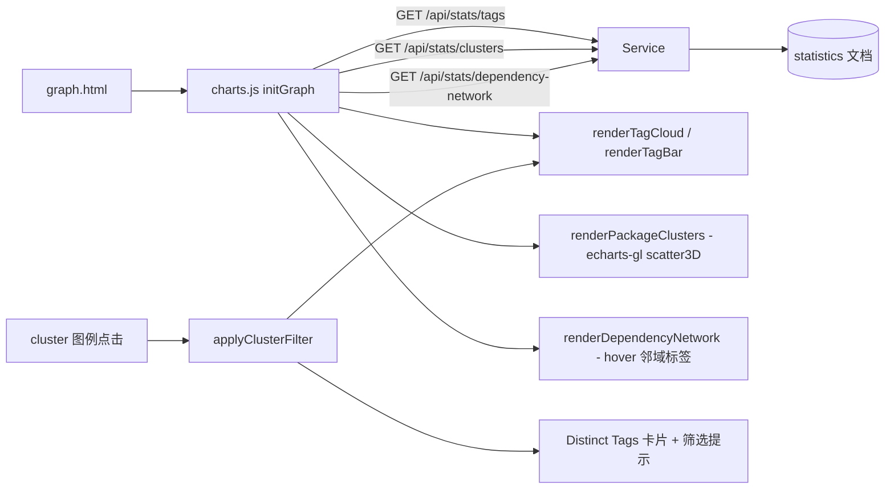

## 产品概述

对 graph.html 可视化页面做一轮 UI 与交互增强：把【UMAP 3D · KMeans】三维插图改为带坐标轴的 ECharts 三维散点图（轴名 UMAP1/UMAP2/UMAP3），把底部的 cluster 图例改为可点击链接以筛选程序包并联动顶部词云与柱状图，同时优化【Nuspec Dependencies】网络图的标签显示策略。

## 核心功能

- **三维散点图（ECharts GL）**：沿用聚类分析结果（每个包的三维嵌入值 + 聚类标签），改为 ECharts 的三维散点渲染；显式绘制三个方向的坐标轴并命名为 UMAP1、UMAP2、UMAP3（含轴刻度与低对比度网格），点颜色仍按聚类标签映射、点大小反映簇规模；悬停显示包名、簇编号与 tag 列表；点击散点仍跳转到对应程序包详情页；保留拖拽旋转与滚轮缩放、窗口尺寸自适应、无数据空态。
- **cluster 图例改为链接筛选**：图例中的每个 cluster 变为可点击链接（保留颜色圆点、簇编号与规模），末位增加 All 链接用于清除筛选；选中项有明确激活态。点击某个 cluster 后，仅统计该簇所属程序包的 tag，并用结果重新渲染顶部【Word Cloud】与【Top 25 Tags】两张图；同时把 Overview 的 Distinct Tags 卡片切换为筛选后的 tag 数，并在区块/图表标题处提示当前筛选（如「cluster 3 · 14 packages」）；点击 All 恢复全量统计。
- **依赖网络标签策略**：默认不显示任何节点名称；鼠标悬停到某个节点时，高亮该目标节点及其一跳邻接节点（含相关连边），并显示这些节点的程序包名标签，其余节点淡化；移出后恢复原状。既有的点击跳转（本机包 → 详情页、外部依赖 → nuget.org）与力导向布局保持不变。
- **视觉一致性**：沿用 scibasic 暗色科技风（深色底、绿色强调、发丝分割线、等宽小标签），仅替换/增强图表与图例的呈现与交互，不改变页面骨架、配色体系与其余区块。

## 技术栈

- 前端：静态 HTML + 原生 JavaScript（IIFE、ES5 风格），沿用既有 `assets/css/scibasic.css` 设计令牌与类名体系。
- 图表：ECharts 5（本地 `assets/vendor/echarts.min.js`）+ `echarts-wordcloud`（已有）+ **新增 `echarts-gl@2.0.9`（UMD，本地 vendor）** 以提供 `grid3D` / `scatter3D`。
- 数据：不新增/修改任何服务端接口；cluster 筛选所需的 tag 频次完全由 `GET /api/stats/clusters` 的 `points[].tags` 在前端聚合得到。
- 约束：外部依赖必须本地化（与既有 echarts/wordcloud/marked 一致），`echarts-gl.min.js` 必须加载在 `echarts.min.js` 之后。

## 实施方案

### 总体思路

把 04 区块的渲染后端从 3d-force-graph 换成 ECharts GL 的 `scatter3D`（同一份 `points` 数据、同样的聚类着色与点击跳转语义），从而获得内置的三维坐标轴/网格/相机控制；随后把 03 区块的两张标签图与 04 区块的图例用同一份聚类文档「串起来」：图例点击 → 记录模块级筛选状态 → 聚合 tag → 复用既有 `renderTagCloud`/`renderTagBar` 重绘；最后调整 05 区块依赖图的标签策略为「默认隐藏、hover 显示目标与一跳邻域」。

### 关键决策与取舍

- **改用 ECharts GL 代替 3d-force-graph**：坐标轴/刻度/网格是 ECharts GL 内建能力，比在 three.js 场景中自绘轴线可靠；同时与页面其余图表统一为 ECharts 实例管理（沿用 `echartsInstances` 与 `bindResize()`）。`assets/vendor/3d-force-graph.min.js` 保留在 vendor 目录以便回退，但页面不再加载它。
- **筛选数据在前端聚合**：聚类文档已含每个包的 tag 列表，客户端聚合无网络往返、无服务端改动，且天然支持「All 反选」；代价是首次需缓存整份文档（当前 70 点/256 tag 量级，可忽略）。
- **重绘前必须 dispose 旧实例**：词云/柱状图会被反复重绘，必须 `echarts.getInstanceByDom(host).dispose()` 后再 `init`，否则画布叠加、内存泄漏、`echartsInstances` 无限增长。
- **依赖图 hover 标签优先用 emphasis 状态**：先尝试 `emphasis: { focus:'adjacency', label:{ show:true, ... } }`；若实测邻接节点标签不出现，则退化为显式事件驱动（`mouseover` 时按 links 建邻接表 → `dispatchAction({type:'highlight', dataIndex:[...]})`，`mouseout/globalout` → `downplay`）。**禁止通过替换 `series.data` 切换标签**，那会触发力导向重新布局、破坏用户体验。
- **不改服务端与数据库**：本轮为纯前端改造，聚类管线与接口保持原样。

### 实现要点

- `renderPackageClusters(containerId, doc)` 重写为：`echarts.init(host)` → `grid3D`（`boxWidth/boxDepth/boxHeight` 约 100，`viewControl:{ autoRotate:true, autoRotateSpeed:6 }` 保留轻微自转，支持拖拽/缩放）→ `xAxis3D/yAxis3D/zAxis3D` 的 `name` 固定为 `UMAP1`/`UMAP2`/`UMAP3`（轴范围取数据 min/max 并加约 8% padding，轴标签用 `TEXT`、轴线用 `HAIRLINE`、网格用 `rgba(255,255,255,.06)`）→ `series[0]` 为 `scatter3D`，数据项形如 `{ value:[x,y,z], name, id, cluster, tags, itemStyle:{ color: clusterColor(cluster) } }`（点大小按簇规模映射；若该版本不支持逐项 `symbolSize`，退化为统一尺寸，以浏览器实测为准）→ `tooltip.formatter` 输出包名/簇/tag（经 `esc()` 转义，沿用暗色 tooltip 模板）→ `chart.on('click')` 保留跳转详情页；实例挂到 `window.__packageClusterChart` 便于调试与端到端断言。
- 图例：`renderClusterLegend(clusters, selected)` 渲染为可点击元素（`button` 或带 `data-cluster` 的 `a`），含 `.dot` 色点与 `cluster N · size` 文案，末位追加 `All`；选中项加 `.on` 类。`applyClusterFilter(clusterOrNull)`：过滤 `points` → 聚合 tag 频次（count 降序、name 升序）→ 重绘两张标签图 → 更新 `#stat-graph-tags`（All 时用缓存的 `/api/stats/tags` 的 `totalTags`）→ 更新 `#cluster-filter-info` 与两张图的 `.mono` 副标题；筛选结果为空时用 `showEmpty` 提示。事件绑定只在 `initGraph()` 内做一次，避免重复绑定。
- 依赖图：`label.show=false` 作为默认；`emphasis.focus='adjacency'` + `emphasis.label.show=true`（`color=TEXT_STRONG`）；必要时按上文退化方案实现；`focusNodeAdjacency`、force 参数、点击跳转与 `.note` 说明保持不变。
- 页面：`graph.html` 脚本顺序为 `echarts.min.js` → `echarts-wordcloud.min.js` → `echarts-gl.min.js` → `assets/js/charts.js`（移除 `3d-force-graph.min.js` 并加注释说明保留原因）；在 03/04 区块补充可寻址提示节点（如 `#cluster-filter-info`、`#tag-cloud-source`、`#tag-bar-source`）。
- 样式：`.cluster-legend .legend-item` 增补 `cursor:pointer`、`:hover` 加深、`.on`（绿色描边 + 轻绿底，沿用 `.btn.on` 语言）、`.all`（中性色）；筛选提示沿用 `.chart-head .mono`/`.mono` 视觉。

### 性能与可靠性

- 聚合与重绘规模为「簇内包数 × 平均 tag 数」（当前 1e2 量级），单次点击开销在毫秒级；连续点击通过 dispose + init 保证不累积实例。
- 所有外部资源本地化，避免内网/离线环境图表失效；`echarts-gl` 下载失败或体积异常时立即向用户报告（本轮确认方案为联网下载，不启用回退实现）。

## 架构设计



## 目录结构（仅列变更文件）

```
g:/xDoc/dist/wwwroot/
├── graph.html                      # [MODIFY] 加载 echarts-gl、移除 3d-force-graph；04 区块标题/提示节点调整，03/04 增加筛选提示与副标题锚点
└── assets/
    ├── vendor/echarts-gl.min.js     # [NEW] echarts-gl@2.0.9 UMD 构建（本地离线，必须在 echarts.min.js 之后加载）
    ├── js/charts.js                 # [MODIFY] renderPackageClusters 改为 scatter3D（UMAP1/2/3 坐标轴、点击跳转、自适应）；renderClusterLegend 改造为可点击 + All；新增 applyClusterFilter（聚合 tag、重绘词云/柱状图、联动统计卡片与提示）；renderDependencyNetwork 改为默认隐藏标签 + hover 邻域标签
    └── css/scibasic.css             # [MODIFY] 图例链接（hover/激活/All 态）与筛选提示样式，三维画布容器微调
```

## 设计定位

在既有 scibasic.net 暗色站点上做图表层增量改造：不改变 topbar / wrap / footer 骨架与配色体系，只替换 04 区块的图表渲染方式、把图例升级为可交互的筛选入口，并收敛 05 区块的标签噪音。

## 改造区块设计

- **UMAP 3D · KMeans（04 区块）**：卡片容器与 620px 暗色径向渐变画布保留；新增三条带箭头方向的坐标轴（UMAP1/UMAP2/UMAP3），轴名用等宽小字、轴标签用中性灰、网格线极低对比度（仅在旋转时提供空间感）；散点颜色沿用 12 色聚类调色板、点大小按簇规模微调；悬停浮层为暗色半透明卡片，显示包名（加粗）+ `cluster N` + tag 列表；拖拽旋转、滚轮缩放、轻微自转。
- **cluster 图例（04 区块底部）**：由纯展示 chip 升级为可点击链接组，保留「9px 圆点 + `cluster N · size`」结构，新增 hover 描边加深与选中态（绿色描边 + ~12% 绿底）；末位 `All` chip 使用中性色表示「取消筛选」；区块头部右侧提示当前筛选范围（如「cluster 3 · 14 packages」）。
- **Word Cloud / Top 25 Tags（03 区块）**：图表本体不变，右侧副标题由固定文案改为数据来源提示（如「cluster 3 packages」/「all packages」），在筛选时同步更新，让用户清楚两张图的统计范围。
- **Nuspec Dependencies（05 区块）**：默认画面更干净（无文字标签，仅节点与依赖箭头）；悬停时目标节点与其一跳邻接节点、相连边一同高亮并显示程序包名标签，其余元素淡化，形成「聚焦局部依赖链」的阅读体验；底部图例说明保持不变。

## 交互与响应式

- 交互：散点点击跳转详情页（保留）；图例点击筛选/反选（All 清除）；依赖图 hover 聚焦邻域、点击跳转（本机包 → 详情页，外部依赖 → nuget.org）。
- 响应式：窗口尺寸变化时图表统一 resize（复用既有机制）；窄屏（≤900px）下三个图表保持单列、画布高度自适应，图例允许换行。

## 状态与空态

- 加载中显示 spinner 文案；`/api/stats/clusters` 空文档时显示「等待首轮聚类分析」提示且不破坏布局；筛选结果为空（该簇无 tag）时在两张图上显示空态文案；任何图表重绘前释放旧实例，避免画布叠加。

## Agent Extensions

### Skill

- **playwright-cli**
- Purpose: 在端到端验证阶段用浏览器打开本地 NuGet 服务器页面，断言三维散点图的 UMAP1/UMAP2/UMAP3 坐标轴存在、cluster 链接筛选后词云/柱状图与 Distinct Tags 卡片同步更新、依赖图默认无标签且 hover 显示邻域标签、散点点击跳转生效，并截图作为验收证据。
- Expected outcome: 产出坐标轴、筛选联动、hover 标签与点击跳转的断言结果与截图，浏览器控制台 0 错误。

### SubAgent

- **code-explorer**
- Purpose: 在下载 echarts-gl 后核实其真实可用 API（`scatter3D`、`grid3D`、`xAxis3D/yAxis3D/zAxis3D` 的 `name`/轴样式、`viewControl`、数据项 `symbolSize`/`itemStyle` 支持情况），避免写出无法运行或降级的配置。
- Expected outcome: 给出该版本 echarts-gl 支持的配置项清单与结论（含逐项 symbolSize 是否受支持），使散点图一次实现成功。