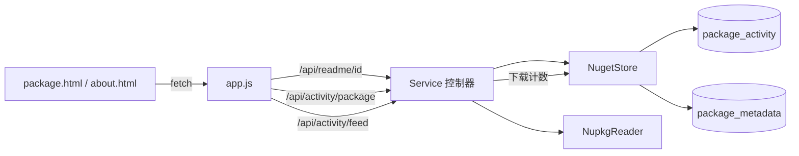

## 产品概述

在现有实验性 NuGet 服务器（src/Nuget 服务端 + dist/wwwroot 前端）上增强“程序包详细信息页面”：新增每日活动统计（下载量、页面访问量）并以 ECharts 曲线展示，同时在包详情页渲染包内 README 文档。

## 核心功能

- **每日活动统计表**：新增一张按“包 + 日期（UTC，yyyy-MM-dd）”记录当日下载量与详情页访问量的数据表，作为曲线数据源。
- **计数写入**：nupkg 真实下载时累加“当日下载量”；每次包详情 JSON API 调用累加“当日访问量”（刷新即计，不做去重）；全站汇总由各包当日数据聚合得到。
- **包详情页图表**：在包详情页用 ECharts 展示该包的每日下载量与访问量曲线（支持切换最近 7/30/90 天），并展示累计值；无数据时给出空态提示。
- **全站图表**：在统计页（about）展示全站每日总下载量与总访问量曲线，并新增“累计页面浏览量”统计卡片。
- **README 渲染**：解析 nuspec 中 `<readme>README.md</readme>` 指向的文档，从 nupkg 中提取并保存；详情页用本地内置的 marked.js 渲染为 HTML（`.md/.markdown` 才渲染，其他扩展名以等宽文本原样展示）；包内不存在 readme 时隐藏该区块。
- **视觉风格**：保持与现有 scibasic.net 暗色风格一致（深色背景、绿色强调色、细分隔线、暗色 ECharts 主题），仅新增区块，不改变既有页面结构与配色。

## 技术栈

- 后端：VB.NET（net10.0）类库 `src/Nuget/Nuget.vbproj`，沿用 Flute HTTP（动态路由已支持 `{param}`）+ JSql 数据引擎，无需改动 Flute/Fluteway。
- 前端：静态 HTML + 原生 JS（IIFE，ES5 风格），沿用 `assets/css/scibasic.css` 设计令牌；图表用已内置的 `assets/vendor/echarts.min.js`；新增本地 `assets/vendor/marked.min.js`。

## 实施方案

### 1) 存储层（NugetStore.vb）

新增表（JSql 无唯一约束/自增/BLOB，需应用层保证唯一性与自增 id，全部访问在既有 `SyncLock sync` 内串行化）：

```
package_activity (
  id INT NOT NULL PRIMARY KEY,
  package_id VARCHAR(200) NOT NULL,   -- 原样大小写，比较时忽略大小写
  day VARCHAR(20) NOT NULL,           -- UTC yyyy-MM-dd
  downloads INT DEFAULT 0,
  views INT DEFAULT 0
)
```

新增模型与 API：

- `DailyActivity`（`day` / `downloads` / `views`）。
- `RecordDownload(packageId, version)`：同一次锁内完成 `packages.downloads + 1`（复用既有 `IncrementDownload` 逻辑）与当日 `downloads + 1`，避免两次整表扫描与中间态。
- `RecordView(packageId)`：当日 `views + 1`。
- `GetPackageActivity(packageId, days)` / `GetFeedActivity(days)`：读全表后在内存过滤（按日范围）与聚合（全站按 day 跨包求和），按 day 升序返回。
- 当日计数的 read-then-write：`SELECT id, downloads, views FROM package_activity WHERE package_id='..' AND day='..'`，命中则 `UPDATE ... SET x = x + 1 WHERE id = ?`，否则 `INSERT`（id 由 `nextId` 生成）；复用既有 `esc()`/`dateLiteral`/`toLong` 工具。
- `NugetStats` 增加 `views As Long`（全站累计页面浏览量，读 `package_activity` 求和）。

### 2) README 解析与提取（NupkgReader.vb + Service.vb）

- `NupkgMetadata` 新增 `Readme As String`，`parse()` 中 `childValue(metadata, "readme")`。
- 新增 `NupkgReader.ExtractEntry(nupkgPath, entryName, destination) As Boolean`（参考现有 `ExtractIcon`：`\`→`/`、`TrimStart("/")`、按 `FullName` 大小写不敏感匹配，支持 `docs/README.md` 这类子目录路径）；`ExtractIcon` 保持原样以避免回归。
- 上传流程（`Service.indexPackage`）：若 `metadata.Readme` 非空，则提取到该版本目录下，文件名 `readme` + 原扩展名（无扩展名默认 `.md`），并写入 `package_metadata`：`readme`（原始 nuspec 路径）、`readmeFile`（落盘文件名）、`readmeFormat`（小写扩展名）。提取失败仅 `warning()` 记日志，不阻断上传。
- 注意：`NugetStore.esc()` 会把换行压平成空格，因此 README 正文**不存数据库**，只落盘为文件，由控制器端点按需返回。

### 3) 新增 HTTP 端点（Service.vb）

为避免与既有 `/api/package/{id}/{version}` 同段数模板产生匹配顺序依赖（`GetMethods` 顺序不保证），新端点使用**首段不同的路径**（与既有 `/api/icon/{id}` 风格一致）：

- `GET /api/readme/{id}`、`GET /api/readme/{id}/{version}`：返回 README 文件内容，`text/markdown; charset=utf-8`（非 md 用 `text/plain; charset=utf-8`），不存在返回 404；实现用 `res.WriteHeader(mime, bytes.Length)` + `res.SendData(bytes)`。
- `GET /api/activity/package/{id}?days=30`：`{ id, days, totalDownloads, totalViews, points:[{day, downloads, views}] }`，缺失日期在服务端补零形成连续序列（`days` 限定 1..365，默认 30）。
- `GET /api/activity/feed?days=30`：`{ days, totalDownloads, totalViews, points:[{day, downloads, views}] }`（全站聚合）。
- 计数接入：`FlatContainerDownload` 的 nupkg 分支由 `IncrementDownload` 改为 `RecordDownload`；`writePackageDetail` 成功后调用 `RecordView(latest.package_id)`（两个详情端点共用该逻辑）；`/api/stats` 响应增加 `stats.views`。
- 详情 JSON 增加 `readme` 对象 `{ available, file, format, url }`（正文不内联，避免详情响应膨胀）；已有版本下载链接继续使用 `/v3-flatcontainer/...`（走控制器，保证下载计数生效）。

### 4) 前端

- 新增 `assets/vendor/marked.min.js`（固定版本，本地 vendor，禁止 CDN）。
- `package.html`：引入 echarts 与 marked；在 Release Notes 之后插入 **Readme** 区块（`#pkg-readme`，默认隐藏），在末尾插入 **Downloads & Page views** 区块（`.chart` + `.chart-head`（含 7/30/90 天切换按钮）+ `.chart-canvas#pkg-trend`），并顺延区块编号。
- `about.html`：引入 echarts；新增全站 **Feed activity** 曲线区块（`#feed-trend`）与第 5 张统计卡片 `#stat-views`。
- `assets/js/app.js`：
- `renderPackageDetail` 增加 README 与曲线加载：`fetch('/api/readme/'+id)` 取文本 → `.md/.markdown` 用 `marked.parse` 渲染，其他扩展名以 `<pre>` 文本展示；无 readme 则隐藏区块。
- **安全要求**：README 来源不可信，必须禁用原始 HTML 直通（覆写 marked 的 `renderer.html` 返回空字符串）并过滤 `javascript:` 形式的链接，防止 XSS。
- 新增 `renderTrendChart(host, points, days)`：ECharts 平滑折线（下载量与访问量两条），配色沿用 `assets/js/charts.js` 的暗色风格（强调色 `#3fae4a`、辅助色 `#6fa8dc`、`rgba(255,255,255,.16)` 轴线、暗色 tooltip），绑定 `window.resize` 自适应；数据为空时输出空态文案。
- `initIndex`/`loadAbout` 增加全站曲线渲染（`/api/activity/feed`）。
- `assets/css/scibasic.css`：新增 `.readme-body`（覆盖 `.article-body` 的 `white-space: pre-wrap` 为 `normal`，并补齐 marked 输出的 `h1-h3/p/ul/ol/code/pre/table/blockquote/a/img` 暗色样式，`img{max-width:100%}`）、趋势容器固定高度（`#pkg-trend, #feed-trend { height: 340px }`）与分段按钮组样式（复用 `.btn`）。

### 5) 关键决策与取舍

- **路径设计规避路由顺序风险**：不改 Flute 的路由匹配策略，通过新端点使用不同首段路径规避同段数模板歧义，零回归风险。
- **README 落盘而非入库**：规避 JSql 无 BLOB 且 `esc()` 压平换行的限制，同时便于浏览器直接获取文本、支持较大文档。
- **按需增量计数**：记录写入为 1 次 SELECT + 1 次 UPDATE（同一锁内），与既有 `IncrementDownload` 成本同级；曲线数据一次整表读入后在内存聚合与补零，数据规模为“包数 × 天数”（约 1e4 量级），成本可接受。
- **已知限制**：通过静态映射直链（`/packages/...`）下载不计入每日下载量；页面与 NuGet 客户端均使用控制器下载路径，故不影响统计口径。

## 架构设计

后端：`Service`（控制器）→ `NugetStore`（JSql 访问与聚合）→ `package_activity`/`package_metadata` 表；`NupkgReader` 负责从 nupkg 提取 nuspec 与 readme。
前端：`package.html`/`about.html` → `app.js`（按 `data-page` 分发）→ `/api/readme/*`、`/api/activity/*`；图表由 ECharts 渲染，README 由 marked 渲染。



## 目录结构（仅列变更文件）

```
g:/xDoc/
├── src/Nuget/
│   ├── NugetStore.vb        # [MODIFY] 新增 package_activity 表与 DailyActivity；新增 RecordDownload/RecordView/GetPackageActivity/GetFeedActivity；NugetStats 增加 views；保持不变更名既有 API
│   ├── NupkgReader.vb       # [MODIFY] NupkgMetadata 增加 Readme；解析 <readme>；新增 ExtractEntry 提取任意文本条目（大小写不敏感、支持子目录）
│   └── Service.vb           # [MODIFY] indexPackage 落盘 readme 并写 readme/readmeFile/readmeFormat；新增 /api/readme/{id}[/{version}]、/api/activity/package/{id}、/api/activity/feed；下载与详情访问计数接入；/api/stats 增加 views；详情 JSON 增加 readme 元信息
└── dist/wwwroot/
    ├── package.html         # [MODIFY] 引入 echarts/marked；新增 Readme 区块与每日曲线区块（7/30/90 切换），顺延区块编号
    ├── about.html           # [MODIFY] 引入 echarts；新增全站活动曲线区块与累计页面浏览量卡片
    └── assets/
        ├── css/scibasic.css # [MODIFY] 新增 .readme-body 内嵌 Markdown 样式、趋势容器高度与分段按钮样式
        ├── js/app.js        # [MODIFY] README 渲染（marked + 原始 HTML 禁用 + javascript: 过滤 + pre 降级）与 renderTrendChart；initIndex/loadAbout 接入全站曲线
        └── vendor/marked.min.js  # [NEW] 本地内置 marked（固定版本，离线可用）
```

## 实施要点

- 所有 `package_activity` 读写必须在 `NugetStore` 既有 Monitor 锁内；`day` 统一用 `Date.UtcNow.ToString("yyyy-MM-dd")`，与 `isoDate` 的 UTC 口径一致。
- 复用现有工具方法（`esc`/`nextId`/`toStr`/`toLong`/`writeJson`/`writeRawJson`/`versionDirectory`/`isoDate`），不引入新依赖库。
- 上传失败路径保持“先校验后落盘”的既有语义，readme 提取失败不阻断发布。
- 前端表格/区块沿用既有类名（`.sec-label`/`.chart`/`.chart-head`/`.chart-canvas`/`.btn`/`.tablewrap`/`.mono`），不新增设计体系。

## 设计定位

在既有 scibasic.net 暗色站点上做增量设计：不改变页面骨架（topbar / wrap / footer.site）与配色体系，仅新增两个内容区块，保持视觉语言统一（细发丝分割线、等宽小标签、绿色强调、克制的动效）。

## 新增区块设计

- **Readme 区块（package.html）**：序号小标签 + 单栏文档容器，宽度与正文 72em 对齐；Markdown 标题层级使用大号无衬线粗体，段落行高约 1.9；行内 code 使用等宽字体 + 深色底 `#101010` + 1px 发丝描边；代码块复用面板底色与横向滚动；表格沿用现有 table 样式；链接默认下划线、悬停转为强调绿；图片限宽 100% 并加圆角与描边。
- **每日曲线区块（package.html / about.html）**：卡片式容器（1px `--hairline2` 描边、悬停加深），头部左侧为等宽小标签标题、右侧为 7/30/90 天分段按钮（幽灵按钮，选中项加色）。图表为透明背景 + 两条平滑折线（下载量=强调绿、访问量=辅助蓝），带淡渐变面积与暗色 tooltip；坐标轴线与分割线保持极低对比度。数据加载中显示 spinner，无数据时显示居中的空态文案。
- **统计卡片（about.html）**：新增“Total Page Views”卡片，与既有四张卡片同构（序号 + 大号数值 + 等宽标签），沿用交错淡入动画与延迟策略。

## 交互与响应式

- 图表在窗口尺寸变化时自适应重绘；分段按钮切换时仅重取对应天数数据并局部更新图表。
- 宽屏（>900px）曲线区块占满内容宽度，窄屏保持单列且降低图例密度；卡片网格在 900px 以下降为单列，与既有规则一致。
- 区块加载采用轻量淡入，不引入页面级动画噪音；README 缺失时整块隐藏，不占位。

## Agent Extensions

### Skill

- **playwright-cli**
- Purpose: 在端到端验证阶段打开本地运行的 NuGet 服务器页面，检查包详情页的 ECharts 每日曲线是否正常绘制、marked.js 是否正确渲染 README，并截图作为验收证据。
- Expected outcome: 产出包详情页与统计页的截图，确认曲线、图例、切天按钮与 README 排版均符合预期且无控制台报错。