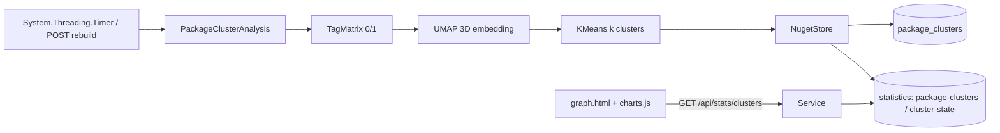

## 产品概述

在现有实验性 NuGet 服务器上增加一套“程序包聚类分析”能力：服务器端周期性（默认 30 分钟）检测是否有新程序包，若有则用全部程序包的 tag 构建 0/1 关联矩阵，先经 UMAP 嵌入到 3 维、再用 KMeans 聚类为 k 类（默认 6，可配置），把每个包的三维坐标与聚类标签写入数据库；graph.html 页面中原【Shared Tags】三维网络图被替换为按聚类标签着色的三维散点图，点击散点跳转到对应程序包详情页。

## 核心功能

- **周期任务**：Nuget 服务启动时创建进程内定时器（默认 30 分钟，可配置/可关闭），比对当前程序包指纹（包数量 + 最新发布时间 + 内容哈希）判断是否有新包；有新包才重建分析结果，未变化则跳过。
- **关联矩阵构建**：提取所有程序包的最新版本，行为程序包、列为所有去重 tag，元素 0/1（该包是否带该 tag）；不带任何 tag 的程序包不参与本次嵌入与聚类。
- **降维与聚类**：矩阵经 UMAP 嵌入为 3 维，再对三维坐标用 KMeans 聚类为 k 类（k 可配置并夹紧到合法范围），为每个包生成三维嵌入值与分类标签。
- **结果持久化**：三维坐标、聚类标签、构建时间与样本/标签数落库；同时生成供前端渲染的聚类文档；分析失败或样本不足时保留上一次结果并记录日志。
- **手动重建接口**：提供受 TOTP 认证保护的管理接口，可用指定 k 值强制重建，并返回本次分析摘要。
- **三维散点可视化**：graph.html 的 04 区块改为 Package Clusters，三维散点使用固定坐标（不做力导向布局）以保留 UMAP 空间含义；点颜色由聚类标签映射，附聚类图例（颜色 + 簇编号 + 规模）；悬停显示包名/簇/标签，点击跳转程序包详情页；无数据时显示空态提示。
- **统计卡片调整**：顶部第 3 张卡片由 Tag Relations 改为 Clusters（显示聚类数）；其余卡片、标签云、柱状图、依赖网络区块保持不变。
- **视觉一致性**：沿用现有 scibasic.net 暗色风格（深色背景、绿色强调、发丝分割线、等宽小标签），仅新增/替换区块，不改变页面骨架与配色体系。

## 技术栈

- 后端：VB.NET（net10.0）类库 `src/Nuget/Nuget.vbproj`，沿用 Flute HTTP（已有 `{param}` 动态路由）+ JSql 数据引擎；新增 ProjectReference 到 `G:\GCModeller\src\runtime\sciBASIC#\Data_science\DataMining\UMAP\UMAP.NET5.vbproj`（级联引入 DataMining.NET5.vbproj = KMeans、Math、Graph、Randomizer、Core），不引入任何新第三方依赖。
- 前端：静态 HTML + 原生 JS（IIFE，ES5 风格），沿用已内置的 `assets/vendor/3d-force-graph.min.js`（自带 three.js）与 `assets/css/scibasic.css` 设计令牌。

## 实施方案

### 1) 总体思路

用“指纹比对 + 后台定时器 + 预计算文档缓存”的现有模式（与 `statistics` 表的用法一致）实现周期性分析：定时器线程计算数据指纹，与上次记录一致则跳过，否则执行「构建矩阵 → UMAP 3 维 → KMeans k 类 → 落库 → 刷新统计文档」；HTTP 请求线程只读取预计算结果，不做实时计算，保证接口响应时间恒定。

### 2) 关键决策与取舍

- **只引用 UMAP 项目**：UMAP.NET5.vbproj 已引用 DataMining.NET5.vbproj（KMeans 所在项目），因此一次 ProjectReference 即可同时获得两个算法，避免重复引用与版本错位。
- **新表 + statistics 缓存文档双写**：`package_clusters` 表承载“包 → 三维坐标 + 聚类标签”的规范化数据（便于包详情页单包读取、便于后续 SQL 统计）；`statistics` 表承载前端一次拉取的整份聚类文档与构建指纹（复用既有 `SaveStatistic/GetStatistic`，无需为前端另建接口协议）。
- **固定坐标的 3D 散点**：使用 `nodeX/nodeY/nodeZ` 访问器 + `cooldownTicks(0)` + `enableNodeDrag(false)` + 空 links，使 3d-force-graph 退化为静态散点，避免力导向布局破坏 UMAP 的空间含义。
- **跳过无 tag 的包**：0 向量在余弦距离下无定义，会污染嵌入结果；因此这类包不进入矩阵，既不出现在散点图，也不参与聚类（符合用户选择）。
- **k 的合法性保护**：KMeans 在 `k >= 样本数` 时会抛异常，故 k 需夹紧到 `[2, 样本数]`；`numberOfNeighbors` 夹紧到 `min(配置值, 样本数-1)`；样本数低于阈值（默认 3）直接跳过本次重建。
- **性能与资源**：矩阵规模为「包数 × tag 数」（当前量级 1e2 × 1e2，二进制矩阵，内存开销可忽略）；UMAP 的 `InitializeFit/Step` 为主要耗时点（秒级~十秒级），全部在后台线程执行，并加 `SyncLock` 保证不与 HTTP 线程和下一次定时触发重入。JSql 每次查询整表读入、写回，因此聚类结果采用“一次性整表替换写入”，并复用 `NugetStore` 的 Monitor 锁。

### 3) 数据与算法细节

- 矩阵：`Data As Double()()`，行 i 对应 `ids(i)`（包 id 小写），列 j 对应 `tags(j)`（tag 小写，按出现次数降序、名称升序）；`tagSets(id) As HashSet(Of String)` 供前端标签展示复用。
- UMAP：`New Umap(distance:=DistanceFunctions.GetFunction(DistanceFunction.Cosine), dimensions:=3, numberOfNeighbors:=neighbors, minDist:=0.1, spread:=1.0)` → `epochs = InitializeFit(matrix)` → `Step(epochs)` → `GetEmbedding()` 得 N×3。
- KMeans：`Dim points() As ClusterEntity = ids.Select(Function(id, i) New ClusterEntity(id, embedding(i)))` → `New KMeansAlgorithm(Of ClusterEntity)(max_iters:=100, n_threads:=Environment.ProcessorCount).ClusterDataSet(points, k)`（或 `points.Kmeans(k)`），标签从 1 开始；同时记录每簇样本数与质心用于图例与诊断。
- 结果文档（前端一次拉取，CamelCase 单行 JSON）：
`{ k, samples, tags, updated, generated, clusters: [{ label, size }], points: [{ id, name, x, y, z, cluster, tags }] }`
- 指纹文档 `cluster-state`：`{ packages, latestPublished, fingerprint, k, updated, samples }`，其中 fingerprint 为“id|version|tags 归一化串”的 SHA256 前 16 字节十六进制，顺序稳定（按 id 排序后拼接），保证与版本、tag 变化强相关。

### 4) 配置项（`--config` ini 或 Fluteway `/run` 透传的配置字典）

| 键 | 默认值 | 含义 |
| --- | --- | --- |
| `cluster-enabled` | `true` | 是否启用周期聚类分析 |
| `cluster-k` | `6` | 聚类数 k（夹紧到 [2, 样本数]） |
| `cluster-interval` | `30` | 定时器周期（分钟） |
| `cluster-min-samples` | `3` | 低于该样本数则跳过重建 |
| `cluster-neighbors` | `15` | UMAP 邻居数（夹紧到 min(配置值, n-1)） |


### 5) 实施要点（防回归）

- 所有 `package_clusters` / `statistics` 读写必须在 `NugetStore` 既有 Monitor 锁内；新增独立 `analysisSync` 只用于阻止定时器与手动重建并发执行，避免持锁时间过长阻塞请求。
- JSON 一律 `WriteIndented=False`（既有 `esc()` 会压平换行，单行 JSON 语义不受影响）。
- 定时器实例必须保存在字段中（否则被 GC 回收导致任务停止），回调内整体 try/catch + `App.LogException`，并在每次执行前后输出 info/warn 日志（含样本数、k、耗时）。
- 首次触发使用 30 秒延迟（避免与服务启动期竞争），失败后不改变周期，下一次周期继续重试。
- `refreshStatistics()`（上传后与 `/api/stats/rebuild` 调用）只负责刷新既有 3 份统计文档，聚类重建保持独立（上传后由定时器在下一个周期内处理），避免上传接口耗时增加；如需即时，可由管理接口强制触发。
- 原 `/api/stats/tag-network`、`BuildTagNetwork` 与 `tag-network` 统计文档保留不动（页面不再调用），便于回退。
- 前端新增的 `renderPackageClusters` 与既有 `renderTagNetwork` 并存，`initGraph()` 仅替换调用点与统计卡片赋值。
- UMAP 项目 `GeneratePackageOnBuild=true`，若其 Pack 所需 None 文件缺失会导致编译失败；实测若失败则通过注释/构建参数（`-p:GeneratePackageOnBuild=false`）规避，并向用户报告。

## 架构设计

后端：定时器/管理接口 → `PackageClusterAnalysis`（矩阵构建 + 指纹 + UMAP + KMeans）→ `NugetStore`（新表 `package_clusters` + `statistics` 文档）→ 前端接口只读缓存文档。
前端：`graph.html` → `charts.js`（`initGraph` 拉取 `/api/stats/clusters`）→ `renderPackageClusters`（3d-force-graph 固定坐标散点 + 图例 + 点击跳转）。



## 目录结构（仅列变更文件）

```
g:/xDoc/
├── src/Nuget/
│   ├── Nuget.vbproj              # [MODIFY] 增加 ProjectReference: UMAP.NET5.vbproj（级联带入 DataMining/KMeans）
│   ├── NugetConfiguration.vb     # [MODIFY] 增加 ClusterEnabled/ClusterK/ClusterIntervalMinutes/ClusterMinSamples/ClusterNeighbors 及其配置键解析（含范围夹紧）
│   ├── NugetStore.vb             # [MODIFY] 新增 package_clusters 表与 PackageClusterRecord 模型；ReplacePackageClusters/ReadPackageClusters/GetPackageCluster（锁内整表替换与读取）
│   ├── PackageClusterAnalysis.vb # [NEW] 分析模块：TagMatrix 构建、指纹计算、UMAP 嵌入、KMeans 聚类、结果组装与落库、Run 摘要返回
│   └── Service.vb                # [MODIFY] Mount 启动定时器；新增 GET /api/stats/clusters、POST /api/stats/clusters/rebuild（TOTP + 可选 k）；详情 JSON 增加 cluster 字段
└── dist/wwwroot/
    ├── graph.html                # [MODIFY] 04 区块改为 Package Clusters（#chart-package-clusters + #cluster-legend），卡片 03 改为 Clusters，文案更新
    └── assets/
        ├── js/charts.js          # [MODIFY] 新增 renderPackageClusters（固定坐标 3D 散点 + 聚类着色 + 图例 + 点击跳转），initGraph 改调 /api/stats/clusters
        ├── js/app.js             # [MODIFY] 包详情页渲染 Cluster 标签 chip（数据来自详情 JSON）
        └── css/scibasic.css      # [MODIFY] 新增聚类图例样式（复用 .chip/.chip-list/.mono），必要时补充散点图容器样式
```

## 关键接口结构（示意）

```
PackageClusterAnalysis.Run(store, options) As AnalysisSummary
  options: K, Neighbors, MinSamples
  returns: { ok, samples, k, tags, updated, message }

GET  /api/stats/clusters          → 200 + 聚类文档（未构建时返回空文档并附 message）
POST /api/stats/clusters/rebuild  → TOTP 校验；可选 k 参数；同步重建并返回摘要
```

## 设计定位

在既有 scibasic.net 暗色站点上做增量改造：仅替换 graph.html 的 04 区块与统计卡片文案，不改变 topbar / wrap / footer 骨架与配色体系，保持细发丝线、等宽小标签、绿色强调的视觉语言。

## 新增区块设计

- **Package Clusters 区块**：卡片式容器（1px `--hairline2` 描边、悬停加深），头部左侧为等宽小标签标题「UMAP 3D · KMeans」，右侧为提示文字「click a point to open the package」；主体为 620px 高的暗色径向渐变画布，静态三维散点以固定坐标分布，点大小随簇规模略有差异，颜色按聚类标签从 12 色暗色系调色板映射，悬停浮层显示包名 + 簇编号 + tag 列表。
- **聚类图例**：区块下方一行 chip 组（颜色圆点 + `Cluster N · size`），复用 `.chip`/`.chip-list` 样式，与标签云的 chip 视觉一致，可读且不喧宾夺主。
- **空态与加载**：未完成首轮分析时显示居中的等宽提示文案；分析数据缺失/失败时显示空态而不破坏布局。
- **统计卡片**：第 3 张卡片标签由 Tag Relations 改为 Clusters，数值取自聚类文档的 k，保持与其余卡片同构与交错淡入动画。

## 交互与响应式

- 散点支持拖拽旋转与滚轮缩放（orbit 控制），保留轻微自动旋转以增强“活着”的感觉；点击散点跳转程序包详情页。
- 窄屏（≤900px）下沿既有规则降低图例密度、画布高度自适应；不引入页面级动画噪音。

## Agent Extensions

### Skill

- **playwright-cli**
- Purpose: 在端到端验证阶段用浏览器打开本地运行的 NuGet 服务器页面，断言三维散点画布已绘制、聚类图例 chip 数量等于 k、点击散点后 URL 跳转正确，并截图作为验收证据。
- Expected outcome: 产出 graph.html 聚类散点图与点击跳转的截图与断言结果，且浏览器控制台无报错。

### SubAgent

- **code-explorer**
- Purpose: 在实现 UMAP 与 KMeans 集成时按需核实算法项目的真实方法签名、命名空间与调用范例（含 `Umap.InitializeFit/Step/GetEmbedding`、`KMeansAlgorithm(Of ClusterEntity).ClusterDataSet`、`ClusterEntity` 构造），避免写出无法编译的调用代码。
- Expected outcome: 给出可直接编译的 VB.NET 调用片段与所需 Imports 清单，确保分析模块一次编译通过。