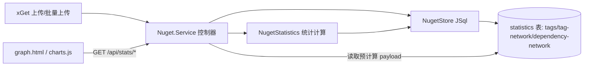

## 产品概述

在现有实验性 NuGet 服务器基础之上，为 `src/Nuget` 服务端增加**可视化统计能力**：从数据库中的包元数据（tags、dependencies）预计算统计结果并存入数据库，前端请求时直接读取并渲染为暗色主题图表；同时为 `src/xGet` 客户端增加**批量上传**能力，并可实际把 `.nuget` 中的程序包上传到本地服务器生成测试统计数据。

## 核心功能

- **标签统计**：统计数据库中各 NuGet 包 tags 的数量分布，生成**标签词云**与**条形图**（ECharts 可视化）。
- **包-标签关系网络**：根据 tags 在程序包之间的交集，生成程序包之间的**三维关系网络图**（3d-force-graph，基于 three.js；节点=包，边=共享标签，边粗细=共享标签数）。
- **依赖网络图**：根据包的依赖关系（A 依赖 B）生成 **NuGet 依赖网络图**（ECharts 力导向图；库内包与外部依赖用不同颜色区分）。
- **统计预计算与持久化**：用户上传程序包成功时刷新统计数据并写入数据库，HTML 页面请求时直接从数据库读取，无需实时重算。
- **暗色主题**：所有图表与页面主题（scibasic.net 暗色技术极简风格）保持一致。
- **独立可视化页面**：新增 `graph.html` 承载三类图表，并在全站顶部导航加入入口。
- **批量上传**：xGet 支持指定文件夹，扫描其中的 NuGet 程序包并顺序批量上传；默认仅顶层 `*.nupkg`（跳过 `*.snupkg`/`*.symbols.nupkg`），提供 `--recursive` 递归子目录与 `--symbols` 包含符号包的开关。
- **测试数据**：使用 `G:\GCModeller\src\runtime\sciBASIC#\.nuget` 中的程序包批量上传，生成并保留测试统计数据以便直接查看图表效果。

## 技术栈

- 服务端：VB.NET / net10.0，类库 `Nuget.vbproj`，由 `Fluteway /run` 反射加载 `Nuget.Service` 控制器运行。
- 数据库：JSql（`JSql.Engine.SqlEngine`），MySQL 子集 SQL，**无参数化 / 无事务 / 无自增 / 无 BLOB**，整表读写、非线程安全。
- 序列化：`System.Text.Json`（服务端 `writeJson` 已统一使用，可安全输出异构 Dictionary/List）。
- 客户端：`xGet.vbproj` 控制台，`System.Net.Http.HttpClient`，复用 `Nuget.TotpModule`。
- 前端：静态 HTML + 现有自定义样式 `assets/css/scibasic.css` + 原生 JS；图表库经 CDN 引入（已实测可用）：
- ECharts `https://cdn.jsdelivr.net/npm/echarts@5.5.1/dist/echarts.min.js`（先加载）
- echarts-wordcloud `https://cdn.jsdelivr.net/npm/echarts-wordcloud@2.1.0/dist/echarts-wordcloud.min.js`
- 3d-force-graph `https://cdn.jsdelivr.net/npm/3d-force-graph@1.73.4/dist/3d-force-graph.min.js`（UMD，内含 three 依赖）

## 实现方案

### 总体策略

分四层推进：**统计计算模块 → 统计持久化与 API → xGet 批量上传 → 可视化页面**。统计结果在「上传成功」时预计算并写入数据库，页面通过只读 API 直接取用；三类图表分别使用 ECharts（词云/条形）、3d-force-graph（三维标签关系）、ECharts 力导向图（依赖网络）。

### 关键决策

1. **统计口径以「去重后的包」为单位**：同一 `package_id` 的多版本只按**最新版本**计入统计（tags 频次、关系网络、依赖网络），避免多版本重复放大。
2. **统计持久化到数据库**：新增 `statistics(name, payload, updated)` 表（`payload` 为预计算好的 JSON 文本，映射为 JSql 的 VARCHAR/LONGTEXT）。读取端点直接回写 payload，页面无需重算。
3. **JSql 无 UPSERT**：`SaveStatistic` 采用「先 `SELECT` 判断存在 → `UPDATE`，否则 `nextId` + `INSERT`」，全程在既有 `SyncLock sync` 内串行执行。
4. **刷新时机**：`Service.uploadPackage` 在 `store.AddPackage(pkg)` 成功之后调用 `refreshStatistics()`；另提供受 TOTP 保护的 `POST /api/stats/rebuild` 用于手动重建；三个查询端点在发现对应 payload 缺失时**惰性触发一次重建**再返回（兼容旧库/首次访问）。
5. **关系网络用倒排索引构建**：以 `tag → 包集合` 倒排，对每个标签下两两累加共享计数，复杂度 O(Σ C(k_i,2))，避免 O(n²) 全量两两比较；边仅保留 `weight ≥ 1`。
6. **依赖网络**：边方向为「依赖方 → 被依赖方」；依赖目标若不在库内则创建 `external=true` 的叶子节点，前端用不同颜色区分。
7. **批量上传逐包重算验证码**：每个文件上传前用本地密钥重新 `GenerateTotp`，避免批量过程超过 30s 时间窗导致 401；对返回码分类处理：`2xx` 成功、`409` 视为「已存在」跳过、`401` 致命停止、其他记录并继续。
8. **上传体积**：服务端沿用 `--max-post-size` 配置；测试批量上传时以放大值启动（如 268435456），避免大包 413。

### 性能与可靠性

- 统计重算为 O(包数 + 边数)，采用倒排索引构建；90 个包量级可接受。
- 批量上传会触发多次重算，均为整表读入/写回且持锁；如观测偏慢，可在批量上传结束后由客户端调用一次 `/api/stats/rebuild` 做最终刷新（端点已提供）。
- 统计 payload 可能较大（关系网络 JSON），写入前统一经 `esc()` 转义（`\`→`\\`、`'`→`''`、换行→空格）。
- 端点对外只读输出预计算 JSON，响应快且与页面解耦；图表容器设固定高度，避免 3D/ECharts 尺寸抖动。
- 关系网络节点/边可能较多，前端对边做轻量裁剪（如仅显示 `weight≥1`，必要时限制 Top-N 标签）保证渲染流畅。

## 架构设计



## 目录结构

```
xDoc/
├── src/
│   ├── Nuget/
│   │   ├── NugetStatistics.vb        # [NEW] 统计计算：标签频次、包-标签关系网络、依赖网络，输出 JSON
│   │   ├── NugetStore.vb             # [MODIFY] 新增 statistics 表与 SaveStatistic/GetStatistic/GetAllStatistics
│   │   └── Service.vb                # [MODIFY] 新增 3 个统计查询端点 + /api/stats/rebuild，上传成功后刷新统计
│   └── xGet/
│       └── Program.vb                # [MODIFY] 新增 batch 子命令（--dir/--recursive/--symbols）与批量上传逻辑
└── dist/wwwroot/
    ├── graph.html                    # [NEW] 可视化页面（词云+条形图、3D 标签网络、依赖网络）
    ├── index.html                    # [MODIFY] 顶部导航加入 Graphs 入口
    ├── package.html                  # [MODIFY] 顶部导航加入 Graphs 入口
    ├── about.html                    # [MODIFY] 顶部导航加入 Graphs 入口
    └── assets/
        ├── css/scibasic.css          # [MODIFY] 追加图表容器与暗色图例/提示样式
        └── js/charts.js              # [NEW] 拉取统计 API 并渲染三类暗色主题图表
```

## 关键代码结构

统计表（JSql）与统计 payload 结构：

```sql
CREATE TABLE IF NOT EXISTS statistics (
  name VARCHAR(100) NOT NULL PRIMARY KEY,
  payload LONGTEXT,
  updated DATETIME
) COMMENT='precomputed nuget statistics'
```

```
// name = "tags"                -> GET /api/stats/tags
{ "totalPackages": 90, "updated": "2026-09-10T...Z",
  "tags": [ { "name": "visualization", "count": 12 } ] }

// name = "tag-network"         -> GET /api/stats/tag-network
{ "nodes": [ { "id": "microsoft.visualbasic.data.framework", "name": "Microsoft.VisualBasic.Data.Framework", "tags": ["data"], "value": 5 } ],
  "links": [ { "source": "a", "target": "b", "weight": 3 } ] }

// name = "dependency-network"  -> GET /api/stats/dependency-network
{ "nodes": [ { "id": "a", "name": "A", "external": false } ],
  "links": [ { "source": "a", "target": "b" } ] }   // source 依赖 target
```

## 服务端接口清单（新增）

- `GET /api/stats/tags`：标签频次分布。
- `GET /api/stats/tag-network`：包-标签交集关系网络（nodes/links）。
- `GET /api/stats/dependency-network`：依赖关系网络（nodes/links）。
- `POST /api/stats/rebuild`（表单 email + TOTP code）：手动重建全部统计并返回摘要。

## xGet 批量上传

- 子命令：`xGet batch --server <url> --email <email> --dir <folder> [--recursive] [--symbols]`
- 扫描：默认顶层 `*.nupkg`，跳过 `*.snupkg` 与 `*.symbols.nupkg`；`--recursive` 递归，`--symbols` 包含符号包。
- 顺序上传，逐包重算 TOTP 验证码；输出 `[i/n] file -> ok|skip(exists)|failed:msg` 与结尾汇总；`409` 跳过、`401` 停止并提示重新注册。

## 设计风格

新增 `graph.html` 沿用现有 scibasic.net 暗色技术极简风格，不引入前端框架，复用 `assets/css/scibasic.css` 的设计令牌与组件（`topbar/wrap/eyebrow/headline/meta/sec-label/note/footer`）。图表库经 CDN 引入：先 ECharts，再 echarts-wordcloud，最后 3d-force-graph。

## 页面规划（graph.html）

1. 顶部导航栏：品牌 Logo 与导航（Packages / Statistics / Graphs / Service Index），当前页高亮。
2. Hero 区：页面标题、导语与统计摘要条目（包总数、标签总数、关系边数、依赖边数）。
3. 标签分布区：左侧 ECharts 词云（`#chart-tag-cloud`），右侧横向条形图（Top 25，`#chart-tag-bar`），两图并排网格布局。
4. 三维标签关系网络区：3d-force-graph 容器（`#chart-tag-network`，约 620px 高），暗色背景 `#030303`，节点按标签数着色（绿色系），边宽 ∝ 共享标签数，支持拖拽旋转缩放。
5. 依赖网络区：ECharts 力导向图（`#chart-dependency-graph`，roam 开启），库内节点与外部依赖节点分类着色（本地=绿、外部=灰/蓝），带图例。
6. 页脚：与其它页面一致的站点页脚。

## 布局与交互

- 统一骨架与容器宽度 `min(1060px, 92vw)`；图表卡片使用现有卡片/发丝线风格。
- 交互：图表容器 hover 阴影与微动效；词云/条形图 tooltip 显示频次；网络图支持缩放、拖拽、hover 高亮；加载态显示现有 `.spinner`，空数据显示 `.empty` 占位。
- 响应式：窄屏下并排图表改为上下堆叠，3D 容器等比缩放。
- 视觉统一：全站共用同一套 `:root` 令牌与 Inter 字体，图表统一 `backgroundColor:'transparent'`、`textStyle.color:'#9a9a9a'`、轴线 `rgba(255,255,255,.16)`、强调色 `#3fae4a`。

## Agent Extensions

### Skill

- **playwright-cli**
- Purpose: 在实现 `graph.html` 后打开本地 Fluteway 伺服页面进行渲染与截图，核对词云、条形图、三维标签关系网络与依赖网络图的暗色主题与数据渲染是否正确。
- Expected outcome: 得到 `graph.html` 各区域的可验证截图，确认图表加载、暗色主题一致、数据非空且交互区域正常。

### SubAgent

- **code-explorer**
- Purpose: 在实现统计持久化与端点时，核对 JSql `SqlEngine`（UPDATE/INSERT/SELECT、`ResultSet`）与现有 `NugetStore`/`Service` 的最新方法签名，避免基于过时假设编码。
- Expected outcome: 产出准确的调用点与签名清单（含文件路径），保证 `statistics` 表读写与端点代码可直接编译并符合既有模式。